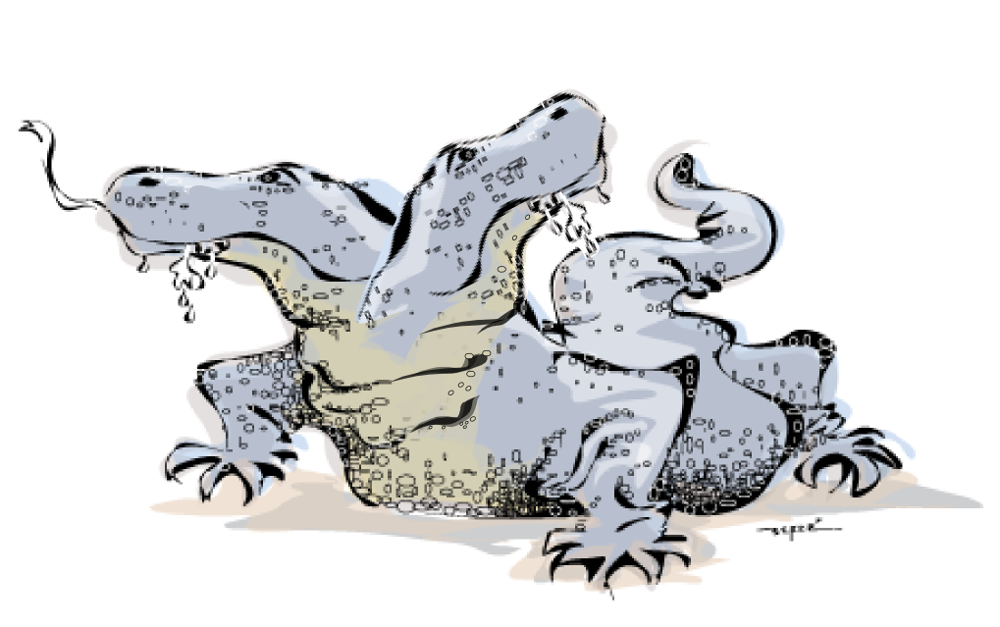
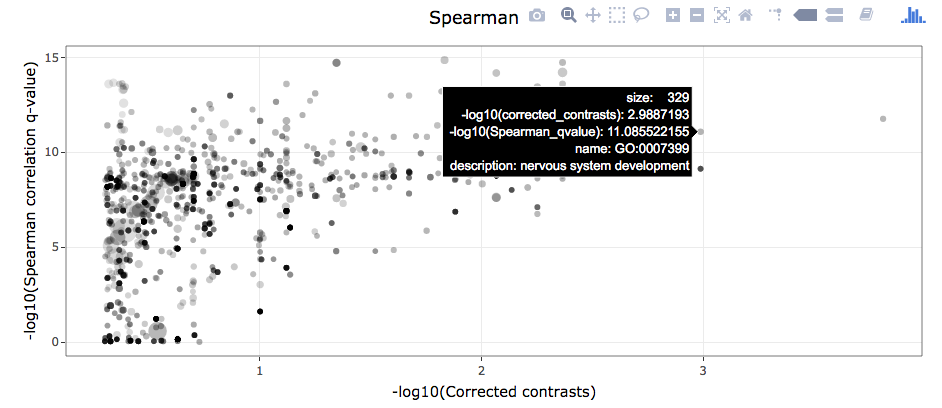
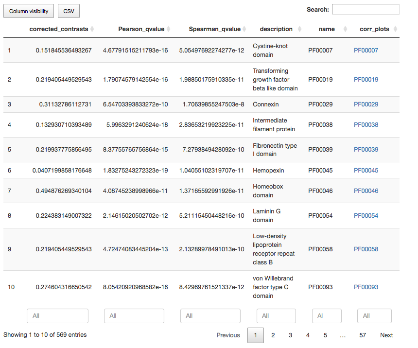
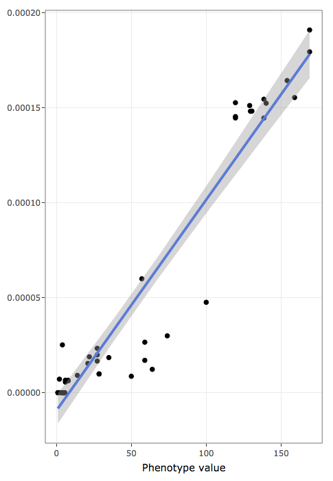
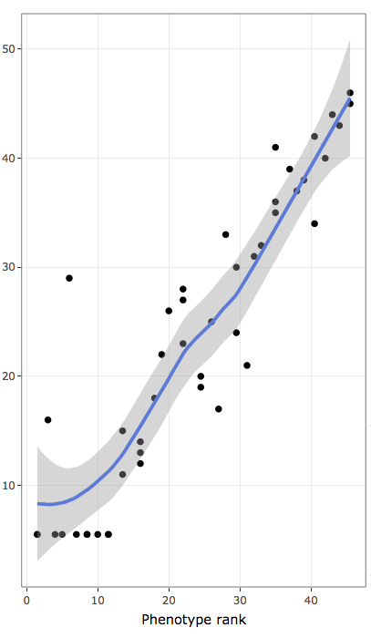
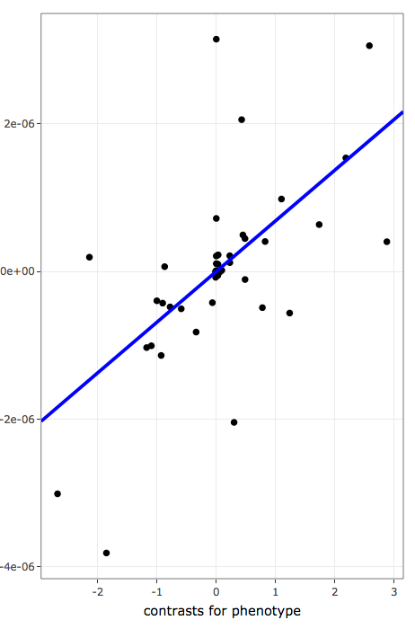

# KOMODO2

<p align="center">

</p>

## MAIN DEVELOPERS

 - Jorge Augusto Hongo (jorgeahongo@gmail.com)
 - Giovanni Marques de Castro (giomcastro@gmail.com)
 - Felipe Campelo (f.campelo@aston.ac.uk, fcampelo@gmail.com)
 - Francisco Pereira Lobo (franciscolobo@gmail.com, francisco.lobo@ufmg.br)

## DESCRIPTION

KOMODO2 is a first-principle, phylogeny-aware comparative genomics software to search for annotation terms (e.g Pfam IDs, GO terms or superfamilies), formally described in a dictionary-like structure and used to annotate genomic components, associated with a quantitave/rank variable (e.g. number of cell types, genome size or density of specific genomic elements).

Our software has been freely inspired by (and explicitly modelled to take into account information from) ideas and tools as diverse as comparative phylogenetics methods, genome annotation, gene enrichment analysis, and data visualization and interactivity.

## HOW TO INSTALL
The latest version of KOMODO2 can be installed directly from the repository using `devtools::install_github()`:

```
devtools::install_github("fcampelo/KOMODO2")
```

Alternatively, you should soon be able to install the last release version from CRAN by simply doing:

```
install.packages("KOMODO2")
```

In either case, please make sure that you have the latest R version (at least 3.6.1) as well as updated versions of all installed packages.

## INSTALLING AND UPDATING DEPENDENCIES
KOMODO2 depends on packages from both **CRAN** and **Bioconductor**. This requires an extra installation step before KOMODO2 can be used. simply run:

```
library(KOMODO2)
install_and_update_packages(which = "all")
```

to install / update all dependencies (packages listed as KOMODO2's `imports` and `suggests`) to their latest versions.

---
## HOW TO USE - OVERVIEW

To run KOMODO2 you need two things: (i) a set of data and (ii) an input list 
defining the path to that data and what is to be done. 

### Retrieving data
A set of example data folders and files can be downloaded directly from the project repository by using function `retrieve_data_files()`. For instance, a call:

```
library(KOMODO2)

retrieve_data_files("./data_folder")
```

will create a folder called `data_folder` in the current working directory path, and download the sample files into subfolders within it. These subfolders will contain:

- genome annotation data files (in "./data_folder/Pfam/" or "./data_folder/gene2GO/")
- metadata files (in "./data_folder/metadata/" or "./data_folder/metadata/")
- phylogenetic tree files (in "./data_folder/trees/")
- dictionary files (in "./data_folder/dics/")

The downloaded data will also contain files that describe the input list mentioned above. A commented template will available at `./data_folder/parameters.txt`, and several full examples under `./data_folder/parameters_validation/`. These full examples represent all input files required to locally reproduce the results reported in a soon-to-be-published article. 

*****

Once these two pieces are in place, the KOMODO2 pipeline can be run by invoking the main function of the package. For instance:

```
output <- run_KOMODO2(defs = "./data_folder/parameters_validation/parameters_gene2GO_Pan_proxy.txt")
```

Or, alternatively:

```
 defs <- list(annotation.files.dir = "./data_folder/gene2GO",
              output.dir           = "./results/GO_Pan_proxy/",
              dataset.info         = "./data_folder/metadata/GO_metadata_Pan_proxy.txt",
              x.column             = 2,
              ontology             = "GO",
              dict.path            = "",
              column               = "GO",
              denominator.column   = "",
              tree.path            = "./data_folder/trees/tree_genome_IDs.nwk",
              tree.type            = "newick",
              linear.model.cutoff  = 0.5,
              type                 = "correlation",
              MHT.method           = "BH")

output <- run_KOMODO2(defs, cores = 4)
```

This call will generate an enriched `KOMODO2` list as the output, and generate a dynamic HTML5 output (plus several tab-separated value (tsv) files in the directory provided as `output.dir`.


## PREPARING YOUR INPUT FILES 

KOMODO2 requires the following files (please check the template in 
`./data_folder/parameters.txt` or the examples in `./data_folder/parameters_validation/` if in doubt about file specifications):

---
### **genome annotation file** 
A text file for each species describing their set of biologically meaningful genomic elements and their respective annotation IDs (e.g. non redundant proteomes annotated to GO terms, or non-redundant protein domains annotated to protein domain IDs). An example of such file, where gene products are annotated using Gene Ontology (GO) terms and Kegg Orthology (KO) identifiers would be as follows:


```sh
Entry   GO_IDs   KEGG_Orthology_ID
Q7L8J4  GO:0017124;GO:0005737;GO:0035556;GO:1904030;GO:0061099;GO:0004860
Q8WW27  GO:0016814;GO:0006397;GO:0008270  K18773
Q96P50  GO:0005096;GO:0046872   K12489
```

And is specified as:

- Fixed number of columns per file (minimum 2) separated by tabs, or "\t".

- First line as the header, each column having a unique column name.

- Each following line having an instance of a genomic feature represented by an unique ID (a specific coding-gene locus found in a genome, for instance)  identifier.

- Multiple terms of the same entry (e.g. a gene annotated to multiple GO terms) should be in the same column and separated by ";", with any number of spaces before and after it. It's use after the last term is optional.

- A column can have no terms in any given row.


In a more abstract representation, files represenging genome annotations for
a single annotation schema would have two columns and the following general
structure:

```sh
genomic_element_name/ID_1     annotation_ID_1;(...);annotation_ID_N
genomic_element_name/ID_2     annotation_ID_12
```

---
### **phylogenetic tree file**
newick or phylip format, containing at least:

- all species to be analyzed (species IDs in the tree must be the same name of text files from the previous step)

- branch lengths proportional to divergence times (a chronogram)

- no polytomies (if there are such cases, KOMODO2 will resolve star branches using [multi2di] method as implemented in [ape] package.


A tree in newick format (however, with no branch lengths), would be: 

```sh
(genome_ID_1,(genome_ID_2,genome_ID_3))
```

---
### **A metadata file** 
containing species-specific information:

- genome ID column (same name of text files and of species in phylogenetic
     trees, must be the first column);

- The quantitave/rank variable used to sort/rank genomes;

- A normalizing factor (e.g. proteome size or length; number of annotation
     terms) to correct for potential biases in datasets (e.g. organisms with
     different annotation levels or with highly discrepant proteome sizes)
     If users are using GO as annotation schema, KOMODO2 can compute a
     normalizing factor that takes into account all GO counts, including
     internal nodes, and therefore may not provide any normalizing factor
     for this case.

The tabular format for the correlation analysis where column 1 contains the genome IDs, column 2 contains the variable to rank genomes and column 3 contains the normalizing factor could be as follows:

```sh
../projects/my_project/genome_ID_1  1.7  2537
../projects/my_project/genome_ID_2  1.2  10212
../projects/my_project/genome_ID_3  0.9  1534
```

Metatada files are specified as follows:

- Fixed number of columns (minimum 2) separated by tabs.

- No header.

- Each line having a unique identifier (first column) with the path of the genome it is referring to or to genome ID. Referred as "genome ID column".

- One mandatory numeric value in every other column, referred as "variable
    columns".

---
### **A dictionary**
tab delimited, linking annotation IDs to their biologically
meaningful descriptions. Our software currently supports two dictionary types:

* Gene Ontology (GO) - in this case, KOMODO2 will automatically recover 
    annotation description and compute values for internal GOs not explicitly
    used to describe data annotation.

* other - in this case, users need to describe a new dictionary linking
    annotation term IDs (e.g. "46456") to their descriptions (e.g. "All alpha
    proteins"), separated by tabs. An example of such file would be:

```sh
Annotation_ID     Annotation_definition
annotation_ID_1   All alpha proteins
annotation_ID_2   Globin-like
annotation_ID_3   Globin-like
annotation_ID_4   Truncated hemoglobin
(...)
annotation_ID_N   annotation_ID_description
```

KOMODO2 can treat each identifier as its own description, saving the work from
preparing an ontology that isn't natively supported. For that, specify no
ontology file and set the ontology parameter as "other" ("ontology = other").


## SETTING UP KOMODO2 PARAMETERS 

KOMODO2's parameters are listed in the documentation of `run_KOMODO2()`, as well as
in the template file provided (`./data_folder/parameters.txt`). They are, for the current version:

- annotation.files.dir (required, string) - Folder where annotation files are located.

- output.dir (required, string) - output folder for results

- dataset.info  (required, string) - genome metadata file, it should contain at least:
    1. path for annotation data (if "annotation.files.dir" not provided OR file names (if "annotation.files.dir) is provided. Please notice this information should be the first column in metadata file;
    2. phenotype data (numeric, this is the value KOMODO2 uses to rank species when searching for associations)
    3. normalization data (numeric, this is the value KOMODO2 uses as a denominator to compute annotation term frequencies to remove potential biases caused by, for instance, overannotation of model organisms or large differences in the counts of genomic elements). Please notice KOMODO2 does not require normalization data for GO, as it computes the total number of GO terms per species and uses it as a normalizing factor.

- x.column (required, numeric) - which column in "dataset.info" contains the phenotype data?

- ontology (required, string)  - which dictionary data type to use? Possible values are "GO" and "other". For GO, KOMODO2 can compute normalization data.

- dict.path (required, string)  - file for dictionary file (two-column file containing annotation IDs and their descriptions, not needed for GO

- column (required, string)  - which column in annotation files should be used (column name)

- denominator.column (optional, numeric) - which column contains normalization data?

- tree.path (required, string)  - path for tree file in either newick or nexus format

- tree.type (required, string)  - tree file type (either "nexus" or "newick", case-sensitive)

- cores (optional, numeric) - how many cores to use? If not provided the function defaults to 1.

- linear.model.cutoff = 0.5 (required, numeric) - Parameter that regulates how much graphical output is produced. We configure it to generate plots only for annotation terms with corrected q-values for phylogenetically independent contrasts smaller than 0.5.

- MHT.method = "BH"  (optional, string)  - type of multiple hypothesis correction to be used. Accepts all methods listed by `stats::p.adjust.methods()`. If not provided the function defaults to "BH".

- type = "correlation" (optional, string) type of analysis to perform. Currently only "correlation" is supported.


## KOMODO2 OUTPUT 

Live examples of KOMODO2 output HTML5 pages can be found <a href="http://www.labbioinfo.icb.ufmg.br/complexity/" target="new">here</a>.

KOMODO2 produces as main output a dynamical HMTL5 page containing two major
components:

- Interactive scatterplots where each point corresponds to an annotation term
   and the following proterties are available:

<p align="center"></center>

   - x-axes are `-log10(q-value(linear model test))`
   - y-axes are `-log10(q-value(association test))`
   - point sizes are proportional to `log10(sum of annotation term count))`
   - point transparencies are proportional to coefficient of variation
   - Mouseover operations provide additional information about each data point.
   - Functions such as zooming in and out and saving images to file are available

- Interactive table for annotation terms, where users can:

<p align="center">
</center>
   
   - Insert or remove data columns
   - Filter results using column values and defining data ranges
   - Rank results using data columns
   - Search results by annotation ID and keywords present in annotation
     descriptions

  Each register in interactive tables also contain links to further inspect
   the distribution pattern of individual annotation terms associated with the
   quantitative variable under analysis. Three plots are provided:

### Leftmost scatter plots
<p>
 - shows actual data values to inspect raw data distribution pattern:
</p>

<p align="center">
</center>

   - x-axis holds the variable used to rank/sort data
   - y-axis holds the frequencies of annotation terms
   - blue line is a linear regression line
   - shaded areas represent confidence bands

### Center scatter plot
<p>
 - contains ranks of data values to inspect monotonic non-linear associations:
</p>

<p align="center">
</center>


  - x-axis contains ranks of variable used to rank/sort data (ties are treated as
               average in R "rank()" function)
  - y-axis contains ranks of frequencies of annotation terms (ties are treated as
               average in R "rank()" function)
  - blue line represents LOESS regression for rank data distribution
  - shaded areas are confidence bands


### Rightmost scatter plot

<p>
 - contains phylogeny-aware linear models of contrasts to inspect linear association after taking phylogenetic relatedness into account:
</p>

<p align="center"></center>

  - x-axis values are phylogenetically independent contrasts for variables
      used to rank/sort data
  - y-axis values are phylogenetically independent contrasts for frequencies
      of annotation terms
  - blue line shows the linear regression line for phylogenetically independent
      contrasts with intercept forced through the origin (model: x ~ y + 0) as
      recomended by [Felsenstein, 1985].


[multi2di]: <https://rdrr.io/cran/ape/man/multi2di.html>
[ape]: <http://ape-package.ird.fr/>
[Felsenstein, 1985]: <https://www.jstor.org/stable/2461605>
