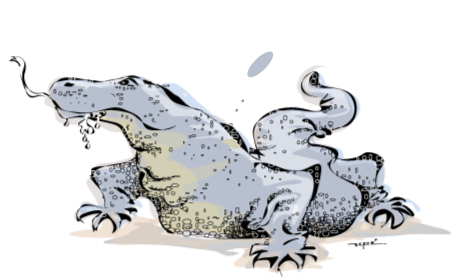

# KOMODO2

<p align="center">

</p>

## MAIN DEVELOPERS

 - Jorge Augusto Hongo (jorgeahongo@gmail.com)
 - Giovanni Marques de Castro (giomcastro@gmail.com)
 - Francisco Pereira Lobo (franciscolobo@gmail.com, francisco.lobo@ufmg.br)

## 1. DESCRIPTION

KOMODO2 is a first-principle, phylogeny-aware comparative genomics software to search for annotation terms (e.g Pfam IDs, GO terms or superfamilies), formally described in a dictionary-like structure and used to annotate genomic components, associated with a quantitave/rank variable (e.g. number of cell types, genome size or density of specific genomic elements).

Our software has been freely inspired into/explicitly modelled to take into account information from/ ideas and tools as diverse as comparative phylogenetics methods, genome annotation, gene enrichment analysis and data visualization and interactivity.


## 2. HOW TO USE - OVERVIEW

To run KOMODO2, set the parameters according to the structure shown in the "parameters.R" file, creating a file pointing to your data/metadata fils. Then, use the R command

```sh
source("your_edited_parameter.R")
```
To create a KOMODO2 object in R, which is a list initially containing all variable values defined in your_edited_parameter.R. Then, execute sequentially:

```sh
source("load.R")
source("clean.R")
source("do.R")
```
to produce several R objects, which can be further explored, a dynamic HTML5 output and several text files in a directory as defined in "your_edited_parameter.R".

Directory "KOMODO2/bin/scripts/parameters_validation/" contains all parameter files required to locally reproduce the results reported in a soon-to-be-published article. In order to use any of them so relative file paths work as expected, please copy any of these configuration files to "KOMODO2/bin/scripts/" (where KOMODO2 .R files are located). From there, parameter_files should provide relative paths to allow KOMODO2 to access text files containing:

 - genome annotation data files (found in "../../data/Pfam/" or "../../data/gene2GO/")
 - metadata files (found in "../../data/metadata/" or "../../data/metadata/")
 - phylogenetic tree files (found in "../../data/trees/")
 - dictionary files (found in "../../data/dics/")
 
The file "func.R" contains the functions used in the "do.R" file, plus some development and support functions. Use its "InstallPackages()" function to install KOMODO2's dependencies. The vast majority of functions are thoroughly commented on source codes.


### 2.1 - INSTALL

Make sure to have an updated version of R, enough so you can use and install packages from Bioconductor. Then, run "InstallPackages()" function from "func.R" to install KOMODO2's dependencies.

After installation, follow instructions above to analyze the Eukarya complexity data (data files available in "data/", parameter files pointing to data files in "bin/scripts/parameters_validation") to check installation success.


### 2.2 - PREPARING YOUR INPUT FILES 

KOMODO2 requires the following files (please check files used to validate software install if in doubt about file specifications):

---

**genome annotation file** - a text file for each species describing their set of biologically meaningful genomic elements and their respective annotation IDs (e.g. non redundant proteomes annotated to GO terms, or non-redundant protein domains annotated to protein domain IDs). An example of such file, where gene products are annotated using Gene Ontology (GO) terms and Kegg Orthology (KO) identifiers would be as follows:


```sh
Entry   GO_IDs   KEGG_Orthology_ID
Q7L8J4  GO:0017124;GO:0005737;GO:0035556;GO:1904030;GO:0061099;GO:0004860
Q8WW27  GO:0016814;GO:0006397;GO:0008270  K18773
Q96P50  GO:0005096;GO:0046872   K12489
```

And is specified as:
  - Fixed number of columns per file (minimum 2) separated by tabs, or "\t".
  - First line as the header, each column having a unique column name.
  - Each following line having an instance of a genomic feature represented by an unique ID (a specific coding-gene locus found in a genome, for instance)  identifier.
  - Multiple terms of the same entry (e.g. a gene annotated to multiple GO
    terms) should be in the same column and separated by ";", with any number
    of spaces before and after it. It's use after the last term is optional.
  - A column can have no terms in any given row.


   In a more abstract representation, files represenging genome annotations for
   a single annotation schema would have two columns and the following general
   structure:

```sh
genomic_element_name/ID_1     annotation_ID_1;(...);annotation_ID_N
genomic_element_name/ID_2     annotation_ID_12
```

---

**phylogenetic tree file** - newick or phylip format, containing at least:

   - all species to be analyzed (species IDs in the tree must be the same name of text files from the previous step)
   - branch lengths proportional to divergence times (a chronogram)
   - no polytomies (if there are such cases, KOMODO2 will resolve star branches using [multi2di] method as implemented in [ape] package.


A tree in newick format (however, with no branch lengths), would be: 

```sh
(genome_ID_1,(genome_ID_2,genome_ID_3))
```

---

**A metadata file** containing species-specific information:
  - genome ID column (same name of text files and of species in phylogenetic
     trees, must be the first column);
   - The quantitave/rank variable used to sort/rank genomes;
   - A normalizing factor (e.g. proteome size or length; number of annotation
     terms) to correct for potential biases in datasets (e.g. organisms with
     different annotation levels or with highly discrepant proteome sizes)
     If users are using GO as annotation schema, KOMODO2 can compute a
     normalizing factor that takes into account all GO counts, including
     internal nodes, and therefore may not provide any normalizing factor
     for this case.

   The tabular format for the correlation analysis where column 1 contains the
   genome IDs, column 2 contains the variable to rank genomes and column 3
   contains the normalizing factor could be as follows:


```sh
../projects/my_project/genome_ID_1  1.7  2537
../projects/my_project/genome_ID_2  1.2  10212
../projects/my_project/genome_ID_3  0.9  1534
```

  Metatada files are specified as follows:
  
  - Fixed number of columns (minimum 2) separated by tabs.
  - No header.
  - Each line having a unique identifier (first column) with the path of the
    genome it is referring to or to genome ID. Referred as "genome ID column".
  - One mandatory numeric value in every other column, referred as "variable
    columns".


4) A dictionary, tab delimited, linking annotation IDs to their biologically
meaningful descriptions. Our software currently supports two dictionary types:

  * Gene Ontology (GO) - in this case, KOMODO2 will automatically recover 
    annotation description and compute values for internal GOs not explicitly
    used to describe data annotation.

  * other - in this case, users need to describe a new dictionary linking
    annotation term IDs (e.g. "46456") to their descriptions (e.g. "All alpha
    proteins"), separated by tabs. An example of such file would be:

```sh
Annotation_ID     Annotation_definition
annotation_ID_1   All alpha proteins
annotation_ID_2   Globin-like
annotation_ID_3   Globin-like
annotation_ID_4   Truncated hemoglobin
(...)
annotation_ID_N   annotation_ID_description
```

KOMODO2 can treat each identifier as its own description, saving the work from
preparing an ontology that isn't natively supported. For that, specify no
ontology file and set the ontology parameter as "other" ("ontology = other").


### 2.3 - SETTING UP KOMODO2 PARAMETERS 

KOMODO2's parameters are listed at the header of the "parameters.R" file.
The file itself contains the default structure, ready to be filled. Directory
"parameters_validation/" contains examples of configuration parameters used
to validate KOMODO2 (copy them to "KOMODO2/bin/scripts/" so file paths work
as expected)

examples to teach how to use KOMODO2.

Exaple of the structure:

```sh
KOMODO2 <- list(annotation_files_dir = "../../data/Pfam/"
                output.dir = "../../results/Pfam_Pan_proxy/",
                dataset.info = "../../data/metadata/Pfam_metadata.txt",
                x.column = 2,
                ontology = "other",
                dict.path = "../../data/dics/Pfam.dic"
                column = "Pfam",
                denominator.column = 4,
                tree_path = "../../data/trees/tree_genome_IDs.nwk"
                tree_type = "newick",
                cores = 4,
                linear_model_cutoff = 0.5
                )
```

   Below are the parameters of the current version:

 -   annotation_files_dir: (char) path to directory where genome annotation files
                                are located (files linking genomic component
                                IDs to annotation_IDs). 

 -   output.dir:           (char) path where to place the output files.

 -   ontology:             (char) which ontology to use: "GO" (or "Gene
                                Ontology") or "other".

 -   dict.path:            (char) ontology's dictionary file (terms and their
                                meaning). Used if 'ontology = "other"'.

 -   column:               (char) column name to use from the annotation files
                                (y variable for correlation analysis).

 -   cores:                (integer) maximum number of processes to run
                                   simultaneously.

 -   dataset.info:         (char) path to the metadata file containing
                                genome IDs (genome ID column) and attribute
                                values (variable to rank/sort genomes and
                                normalizing factor). First column must contain
                                genome IDs.

 -   x.column:             (integer) number of column of metadata file to be used
                                   as the rank/sort variable.

 -   denominator.column:   (integer) optional parameter, number of column to be
                                   used to normalize annotation counts

 -   tree_path:            (char) path to phylogenetic tree file to be used when
                                computing phylogeny-aware linear models.

 -   tree_type:            (char) type of phylogenetic tree (either "phylip" or
                                "nexus" provided in "tree_path".

### 2.4 - RUNNING KOMODO2

Set parameters according to the structure from "parameters.R" and use it to
create the KOMODO2's variable

```sh
source("<your_parameter_file.R>")
```
Then, run:

```sh
source("load.R")
source("clean.R")
source("do.R")
```
If executed successfully, KOMODO2 will save results in the path specified in the path provided by "output.dir" parameter (e.g. output.dir = "../results/my_experiment").

Note that R is case-sensitive and requires quote marks (' or ") to treat
your input as a character, rather than an existing variable.


## 3 - KOMODO2 OUTPUT 

KOMODO2 produces as main output a dynamical HMTL5 page containing two major
results:

 ### Interactive scatterplots where each point corresponds to an annotation term
   and the following proterties are available:

<p align="center"></center>

   * x axis are -log10(q-value(linear model test))
   * y axis are -log10(q-value(association test))
   * point size are proportional to log10(sum of annotation term count))
   * point color are proportional to coefficient of variation
   * Mouseover operations provide additional information about each data point.
   * Funcions as zoom in and out and image save available

### Interactive table for annotation terms, where users can:
   
   * Insert or remove data columns
   * Filter results using column values and defining data ranges
   * Rank results using data columns
   * Search results by annotation ID and keywords present in annotation
     descriptions

 - Each register in interactive tables also contain links to further inspect
   the distribution pattern of individual annotation terms associated with the
   quantitative variable under analysis. Three plots are provided:

---

### Leftmost scatter plot - contains actual data values:

<p align="center">
</center>

   - x-axis are the values of variable used to rank/sort data
   - y-axis are the values of frequencies of annotation terms
   - blue line is the linear model regression
   - gray areas are confidence intervals
  

---

### Center scatter plot - contains ranks of data values:


<p align="center">
</center>


  - x-axis values are ranks of variable used to rank/sort data (ties are treated as
               average in R "rank()" function)
  - y-axis contain ranks of frequencies of annotation terms (ties are treated as
               average in R "rank()" function)
  - blue line is the loess regression for rank data distribution
  - gray areas are confidence intervals


---

### Rightmost scatter plot - contains phylogeny-aware linear models for contrasts:

<p align="center"></center>

  - x-axis values are phylogenetically independent contrasts for variables
      used to rank/sort data
  - y-axis values are phylogenetically independent contrasts for frequencies
      of annotation terms
  - blue line are the linear models for phylogenetically independent
      contrasts with intercept forced through origin (model = x ~ y + 0) as
      recomended by Felsenstein, 1985.


[multi2di]: <https://rdrr.io/cran/ape/man/multi2di.html>
[ape]: <http://ape-package.ird.fr/>
